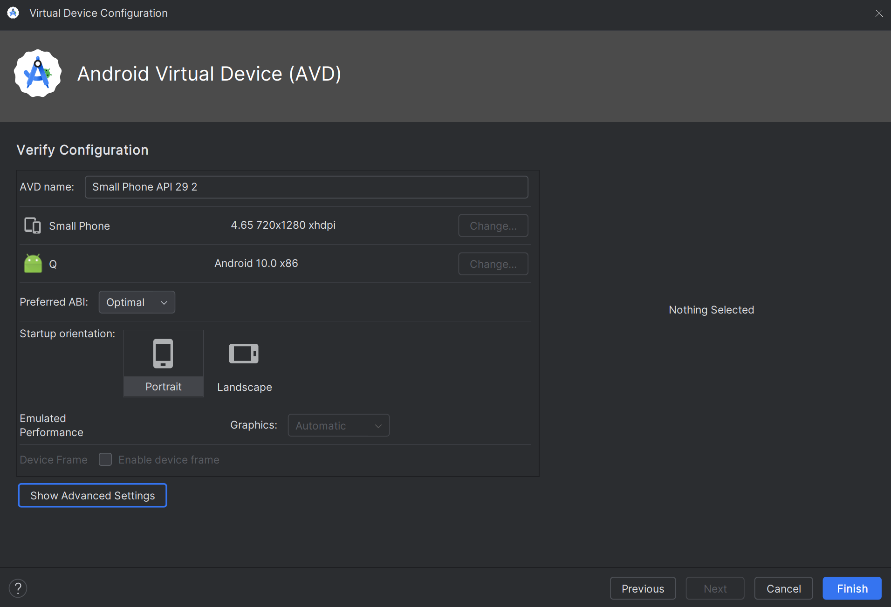

[comment]: <> (@rmorata: This guide is for tohse running a lower end computer that can't run the latest version of android on their android emulator smoothly.)

# 🥔 Guide for those who run a potato

## 🐑 Setting up a earlier version of Android using Android Studio's Emulator

Go into android studio and under **More Actions** click **Virtual Device Manager**


This will open your Virtual Device Manager


At the top there will be a **+** button and select **Small Phone**


Now it will ask you to select a version of android as the **System Image**. Select ```Release Name Q, API 29, ABI x86``` which is Android 10 circa 2017.


After that, you do not need to change any of the advanced settings for optimization unless youk now what you're doing. We do not need more than 2GB storage, etc. for development. Select Finished.



## Getting the development build into the emulator

Download the latest development build from expo and drag and drop into the emulator.


